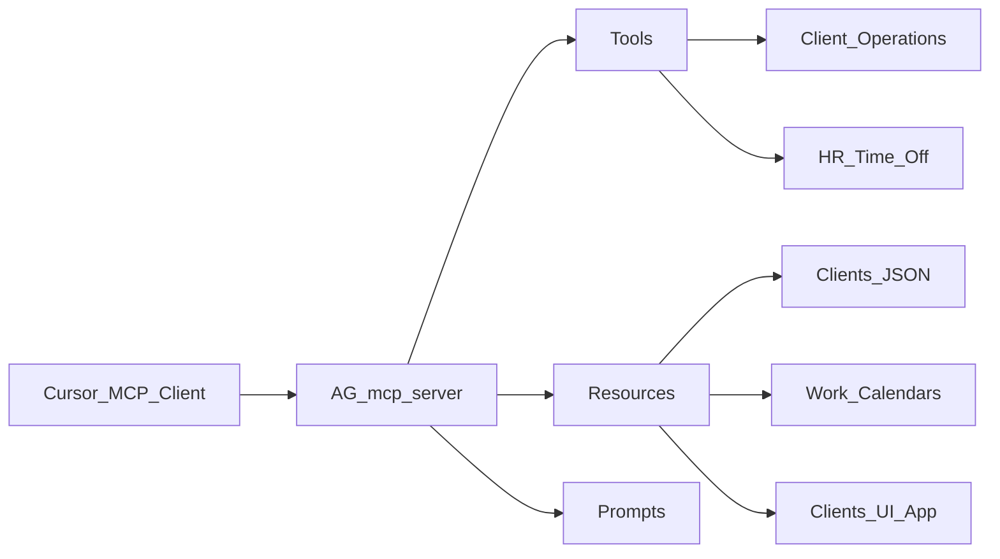

# AG-mcp-server Documentation

This document describes the configured MCP server named `AG-mcp-server` using only information observable from the MCP server surface: registered tools, resources, prompts, and safe read-only live responses.

It intentionally does not describe repository source files, implementation classes, local project structure, or inferred internals.

## Server Overview

`AG-mcp-server` exposes three main MCP capabilities:

- `Tools`: callable operations for client records, client UI access, HR policy questions, and time-off workflows.
- `Resources`: readable data or UI resources exposed through MCP URIs.
- `Prompts`: reusable workflow guides that help a client choose the right tools and sequence of actions.



## Tool Catalog

### Client And Invoicing Tools

`get_clients`

Retrieves a paginated list of clients for L&L Company.

Arguments:

- `page` integer, optional, default `1`.
- `pageSize` integer, optional, default `20`.
- `search` string or `null`, optional.
- `sortBy` string or `null`, optional.
- `sortDescending` boolean, optional, default `false`.

Observed output shape:

```json
{
  "items": [
    {
      "id": "uuid",
      "name": "Client name",
      "taxId": "Tax ID",
      "email": "email@example.com",
      "phone": "optional phone",
      "address": "optional address",
      "isActive": true,
      "createdAt": "2026-05-19T00:16:16.825179"
    }
  ],
  "page": 1,
  "pageSize": 3,
  "totalCount": 26
}
```

`get_client_by_id`

Retrieves one L&L Company client by ID.

Arguments:

- `id` string, required, UUID format.

Use this when the caller already has the exact client ID.

`get_client_summary`

Retrieves a financial summary for one L&L Company client.

Arguments:

- `id` string, required, UUID format.

Use this after identifying a client and needing invoice/payment/balance-style summary information.

`create_client`

Creates a client programmatically.

Arguments:

- `request` object, required.
- `request.name` string, required.
- `request.taxId` string, required.
- `request.email` string or `null`, required.
- `request.phone` string or `null`, required.
- `request.address` string or `null`, required.

Usage note: this tool requires all fields up front. It is not the preferred tool for conversational client onboarding when some fields may be missing.

`create_client_elicit`

Default conversational client-creation tool.

Arguments:

- `name` string or `null`, optional.
- `taxId` string or `null`, optional.
- `email` string or `null`, optional.
- `phone` string or `null`, optional.
- `address` string or `null`, optional.

Usage note: this tool is designed for chat-style client creation. If required information is missing, the server can collect it through MCP elicitation.

`update_client`

Updates an existing L&L Company client.

Arguments:

- `id` string, required, UUID format.
- `request` object, required.
- `request.name` string, required.
- `request.taxId` string, required.
- `request.email` string or `null`, required.
- `request.phone` string or `null`, required.
- `request.address` string or `null`, required.
- `request.isActive` boolean, required.

Usage note: this is a full update contract. The caller should provide the complete updated client state, not only changed fields.

`sample_create_client_action`

Demonstrates MCP sampling by asking the connected client LLM to extract client details from natural language and return a structured action for `create_client_elicit`.

Arguments:

- `message` string, required. Natural language request containing client information.

Usage note: this is useful for testing or demonstrating sampling-assisted structured action generation. It was not invoked during this analysis.

`open_clients_ui`

Opens the local Angular-style clients app for creating and listing clients.

Arguments: none.

Usage note: this is a UI-oriented tool. It was not invoked during this analysis because the documentation pass avoided side-effecting or navigation actions.

### HR, Policy, And Time-Off Tools

`plan_time_off`

Helps L&Lemployees plan and answer questions about time off.

Arguments:

- `employeeId` string, required.

Declared behavior:

- Uses the employee's scheduled time-off calendar and office location calendars.
- Helps avoid scheduling time off during holidays or overlapping existing time off.
- Can answer questions about upcoming work holidays for the current year.
- Can answer time off, absence, and leave policy questions.
- If policy information is missing or unsupported, the caller should not assume the answer and should direct the employee to HR.

`request_time_off`

Requests time off for an employee.

Arguments:

- `employeeId` string, required.
- `request` object, required.
- `request.days` array, required.
- `request.days[].date` string, required, date-time format.
- `request.days[].dayType` string, required. Allowed values:
  - `FullDay`
  - `HalfDayMorning`
  - `HalfDayAfternoon`
- `request.timeOffType` string, optional, default `Vacation`. Allowed values:
  - `Vacation`
  - `PersonalHoliday`
  - `SickDay`
  - `MedicalOrFMLALeave`
  - `PersonalLeaveOfAbsence`
  - `Sabbatical`

Declared output schema:

```json
{
  "success": true,
  "message": "Request message",
  "requestId": "request id"
}
```

Usage notes:

- The tool supports one time-off type per request.
- Days should not fall on weekends.
- The caller should summarize dates and time-off type before calling.
- Personal Holiday requests should consider annual policy limits.

`ask_about_policy`

Answers questions about L&Lbenefits policies.

Arguments:

- `policyQuestionType` string, required. Allowed values:
  - `VacationOrHolidays`
  - `SickLeave`
  - `FamilyLeave`
  - `PersonalLeaveOfAbsence`
  - `Sabbatical`
  - `MedicalBenefits`
  - `VisionBenefits`
  - `DentalBenefits`
  - `RetirementPlans`

Declared behavior:

- Intended for benefits policy questions such as medical, dental, vision, and retirement plans.
- The server description says `plan_time_off` is better for sabbaticals, leave, and vacation.
- If returned policy excerpts are missing or unsupported, the caller should not assume and should direct the employee to HR.

Verification note: this tool is registered, but a read-only invocation with `MedicalBenefits` returned an invocation error during this analysis.

## Resource Catalog

`l&linvoicing://clients`

Name: `clients.json`

MIME type: `application/json`

Description: provides a paginated list of clients in the L&L Company invoicing system. The response includes client ID, name, tax ID, contact information, active status, creation timestamp, paging information, and total count.

Verified live observation:

- The resource returned JSON successfully.
- The observed response had `page: 1`, `pageSize: 50`, and `totalCount: 26`.
- The document does not reproduce individual client records to avoid exposing unnecessary contact details.

`L&L ://hrm/calendars/work`

Name: `work-calendars.json`

MIME type: `application/json`

Description: returns holiday calendars for work locations.

Verified live observation:

- The resource returned JSON successfully.
- The observed response included 2026 holiday calendars for `us` and `in`.
- Example holiday names included New Year's Day, Memorial Day, Thanksgiving Day, Republic Day, Diwali, and Christmas Day.

`ui://ag.mcp/clients`

Name: `clients-ui`

MIME type: `text/html;profile=mcp-app`

Description: MCP App shell that renders the local clients screen.

Verified live observation:

- The resource returned HTML successfully.
- The HTML includes an `<app-root>` Angular-style application shell.
- If no URL hash is present, the app sets the hash to `#/clients/agent-create`.
- The embedded UI resource includes routes for:
  - Clients: list, create, edit, summary, and agent-create.
  - Invoices: list, pending, overdue, create, detail, and edit.
  - Payments: list, create/register payment, and detail.
  - Reports: accounts receivable, sales summary, and client statement.

## Prompt Catalog

### Client Workflow Prompts

`Bulk Client Operations Guide`

Guide for performing operations on multiple clients using list, pagination, and repeated create or update calls.

Arguments: none.

`Client Validation Guide`

Guide for verifying client data before creating or updating clients, including tax ID validation, contact information, and duplicate checks.

Arguments: none.

`Client Exact Name Search`

Searches clients by exact `Name` value and ignores partial or non-name matches.

Arguments:

- `name` string, required. Exact client name to search for.

`Client Lookup Guide`

Guide for finding and retrieving client information by ID or search criteria.

Arguments: none.

`Client Onboarding Guide`

Guide for creating and setting up new clients with validated information.

Arguments: none.

`Client List Management Guide`

Guide for browsing, filtering, and managing client lists.

Arguments: none.

`Client Financial Analysis Guide`

Guide for analyzing client financial summaries, invoices, payments, and balances in the invoicing system.

Arguments: none.

`Client Search Guide`

Guide for searching clients by name, tax ID, or other criteria with sorting and pagination.

Arguments: none.

`Client Update Guide`

Guide for modifying and maintaining existing client information.

Arguments: none.

### Time-Off Prompt

`Suggest Time Off Work`

Uses the planning tool to find ideal dates for time off work, taking company holidays and weekends into account.

Arguments:

- `employeeId` string, required. Example format shown by the server: `4562`.

## Observed Read-Only Behavior

The following checks were performed without creating, updating, or deleting business data:

- `get_clients` was called with `page: 1` and `pageSize: 3`; it returned three client summaries and reported `totalCount: 26`.
- `l&linvoicing://clients` was fetched successfully and returned the clients JSON resource.
- `L&L ://hrm/calendars/work` was fetched successfully and returned 2026 calendars for US and India.
- `ui://ag.mcp/clients` was fetched successfully and returned an MCP App HTML resource.
- `ask_about_policy` was called with `MedicalBenefits`, but the invocation returned an error.

The following tools were not invoked because they may create, update, request, navigate, or otherwise trigger side effects:

- `create_client`
- `create_client_elicit`
- `update_client`
- `sample_create_client_action`
- `open_clients_ui`
- `request_time_off`

`plan_time_off` was also not invoked because it requires an employee ID and may retrieve employee-specific planning context.

## Recommended Usage Patterns

For client lookup:

1. Use `get_clients` with `search`, pagination, and sorting to find candidate clients.
2. Use `get_client_by_id` once the exact UUID is known.
3. Use `get_client_summary` when the user asks about financial status, invoices, balances, or payment summary for a specific client.

For conversational client creation:

1. Prefer `create_client_elicit`.
2. Provide any known values: `name`, `taxId`, `email`, `phone`, and `address`.
3. Let MCP elicitation collect missing required details when available.

For programmatic client creation:

1. Use `create_client` only when all required fields are already known.
2. Provide nullable optional contact fields explicitly as strings or `null`.

For updates:

1. Retrieve or confirm the existing client first.
2. Use `update_client` with a complete update payload, including `isActive`.

For HR policy and time off:

1. Use `plan_time_off` for leave, vacation, sabbatical, and holiday-planning questions.
2. Use `ask_about_policy` for benefits policy topics such as medical, dental, vision, and retirement.
3. Use `request_time_off` only after confirming employee ID, requested dates, day type, and time-off type.
4. Do not infer missing policy details; direct the employee to HR when the MCP response does not support a specific answer.

## Verification Gaps

- The documentation is based on the currently registered MCP surface and live read-only calls only.
- Mutating tools were intentionally not executed.
- `ask_about_policy` is listed because it is registered, but its live response was not verified successfully.
- Tool behavior beyond names, descriptions, schemas, and safe read-only calls should be validated separately before relying on it for production workflows.
