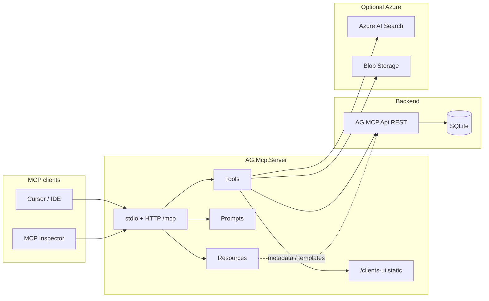

# AG.MCP — Lunch & Learn solution

This folder contains a **hands-on MCP (Model Context Protocol) reference solution**: a .NET **MCP server** that exposes tools, prompts, and resources to AI clients, backed by a **simulated company REST API** (invoicing), optional **Azure** integrations, and an **Angular** UI surfaced as an MCP App.

## Solution file

- **`AG.Mcp.Server.sln`** — opens all projects below.

## Projects at a glance

| Project | Role |
|--------|------|
| **`AG.Mcp.Server`** | ASP.NET Core **MCP host**: JSON-RPC over **stdio** and/or **HTTP** (`/mcp`), registers tools/prompts/resources, calls the invoicing API and Azure services, serves static **clients-ui** under `/clients-ui`. |
| **`AG.MCP.Api`** | **Eggs Company Invoicing** REST API: clients, invoices, payments, reports. SQLite by default; Clean Architecture (API → Application → Domain ← Infrastructure). |
| **`AG.MCP.Domain`** | Entities and enums; no infrastructure references. |
| **`AG.MCP.Application`** | Use cases, DTOs, validators, service interfaces. |
| **`AG.MCP.Infrastructure`** | EF Core `DbContext`, repositories, migrations, seed data. |
| **`AG.MCP.Ui`** | Angular SPA; built for MCP with `npm run build:mcp` and hosted from `AG.Mcp.Server/wwwroot/clients-ui`. |

Supporting docs:

- **`docs/IMPLEMENTATION_NOTES.md`** — invoicing API behavior, sample HTTP calls, AR logic.
- **`docs/MCP-CONCEPTS.md`** — MCP vocabulary from junior to senior level (tools, prompts, resources, apps, sampling, elicitation).

## How it fits together

High-level flow: the **MCP client** (Cursor, MCP Inspector, or another host) talks to **AG.Mcp.Server**. The server runs **tools** that call **AG.MCP.Api** over HTTP. Optional **resources** (calendars, client lists) and **prompts** (guided workflows) enrich the session. The **MCP App** resource serves HTML so the host can embed the Angular **clients** UI.



## Local development

From **`AG.MCP`**, run:

```powershell
.\start-dev.ps1
```

This script builds the Angular MCP bundle, then starts separate consoles for the **API**, **MCP server**, **MCP Inspector**, and **`npm start`** for the UI. Ports are documented in the script (API, MCP, Inspector, etc.).

**Cursor** can point at the HTTP MCP endpoint; see `.cursor/mcp.json` in this repo for an example (`http://localhost:7070/mcp` when using the Inspector launch pattern).

## Configuration

- **`AG.Mcp.Server/appsettings.json`** — invoicing API base URL, optional Azure Search and HRM blob settings, MCP public base URL for asset rewriting.
- **User secrets / environment variables** — preferred for secrets locally and in deployment.

## Learning path

1. Open **`AG.Mcp.Server.sln`** and read **`Program.cs`** (MCP registration, transports, static files).
2. Browse **`AG.Mcp.Server`** for `[McpServerTool]`, `[McpServerPrompt]`, `[McpServerResource]`.
3. Use **`docs/MCP-CONCEPTS.md`** to align terminology with your audience.
4. Exercise the **invoicing API** via Swagger and **`docs/IMPLEMENTATION_NOTES.md`**, then invoke the same behavior through MCP tools.
