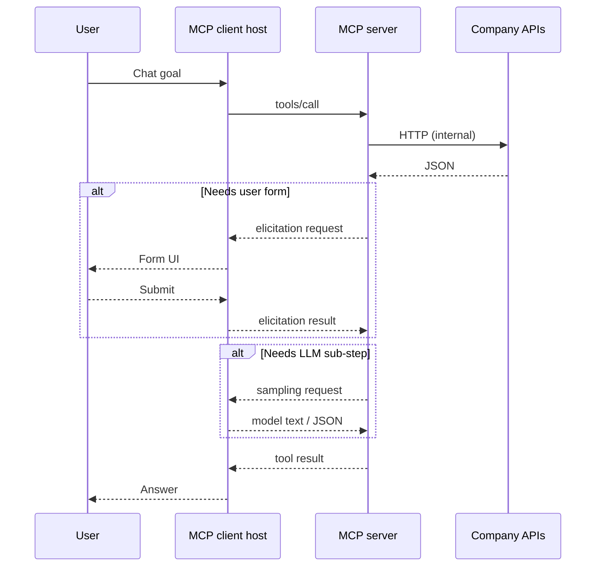

# 🧠 MCP concepts

This guide explains the main **Model Context Protocol (MCP)** concepts using two levels:

- **Short Definition** - a simple explanation that works well for a quick Lunch & Learn introduction.
- **Deep Definition** - a senior-level explanation with implementation and architecture considerations.

Examples refer to patterns used in **`AG.Mcp.Server`**.

## 🧭 Menu

- [🧩 Concepts](#concepts)
  - [MCP](#mcp)
  - [RPC](#rpc)
  - [JSON-RPC](#json-rpc)
- [🖥️ MCP server](#mcp-server)
- [🏠 MCP host](#mcp-host)
- [🔌 MCP client](#mcp-client)
- [🛠️ MCP server tools](#mcp-server-tools)
- [🧾 MCP server prompts](#mcp-server-prompts)
- [📚 MCP server resources](#mcp-server-resources)
- [🪟 MCP server apps](#mcp-server-apps)
- [🧪 Sampling](#sampling)
- [🙋 Elicitation](#elicitation)
- [🔄 How the pieces work together](#how-the-pieces-work-together)
- [⚡ Quick glossary](#quick-glossary)

---

## 🧩 Concepts

### MCP

**Short Definition:** MCP means **Model Context Protocol**. It is a standard way for an AI assistant to connect to external systems, such as APIs, files, databases, tools, and business workflows, without every app inventing its own integration style.

**Deep Definition:** MCP is a vendor-neutral application-layer protocol for connecting AI hosts to external context and capabilities. It standardizes a client-server relationship, JSON-RPC message shapes, lifecycle negotiation, and primitives such as tools, resources, and prompts. In enterprise systems, MCP acts as a controlled boundary: the model does not directly own your APIs or data stores; it reaches them through explicit server contracts that can enforce authorization, validation, logging, and policy.

**References:** [MCP specification](https://modelcontextprotocol.io/specification/latest), [MCP architecture overview](https://modelcontextprotocol.io/docs/learn)

### RPC

**Short Definition:** RPC means **Remote Procedure Call**. It is a way for one program to ask another program to run a named operation and return a result.

**Deep Definition:** RPC is a communication pattern where a caller invokes a procedure on a separate component as if it were a local function, while the runtime handles serialization, transport, execution, and response correlation. In MCP, tools feel like RPC operations: a client sends a method name plus arguments, the server executes controlled code, and the response returns structured data or an error.

**References:** [JSON-RPC specification](https://www.jsonrpc.org/specification)

### JSON-RPC

**Short Definition:** JSON-RPC is an RPC protocol where requests and responses are written as JSON objects. MCP uses JSON-RPC as its message format.

**Deep Definition:** JSON-RPC 2.0 is a lightweight, transport-agnostic protocol. A request usually contains `jsonrpc`, `method`, optional `params`, and an `id` that correlates the response. A response contains either `result` or `error`. MCP builds on this predictable shape so the same semantic messages can move over different transports, such as stdio or HTTP-based streams.

**References:** [JSON-RPC 2.0 specification](https://www.jsonrpc.org/specification), [MCP specification](https://modelcontextprotocol.io/specification/latest)

---

## 🖥️ MCP server

**Short Definition:** An MCP server is the program you run to expose safe AI-accessible capabilities from your systems. It can publish tools, prompts, resources, and apps to an MCP client.

**Deep Definition:** The server implements the MCP server role: initialization, capability advertisement, request routing, and execution of declared primitives. In .NET, `ModelContextProtocol.AspNetCore` lets the same host expose stdio and HTTP transports while keeping the MCP message semantics consistent. Architecturally, the server should be treated as a policy and adapter layer: it maps stable AI-facing contracts to internal APIs, enforces validation and authorization, isolates side effects, and logs activity for auditability.

**References:** [MCP server specification](https://modelcontextprotocol.io/specification/latest/server), [MCP architecture overview](https://modelcontextprotocol.io/docs/learn)

---

## 🏠 MCP host

**Short Definition:** An MCP host is the AI application the user interacts with, such as an IDE, desktop assistant, or chat app. It owns the user experience and can connect to one or more MCP servers.

**Deep Definition:** The host is the top-level application that embeds the model experience and manages MCP clients. In the MCP architecture, a host may create a separate MCP client connection for each configured server, control what servers are available, decide how tools/resources/prompts appear to the user and model, and enforce user consent or security policy. Cursor is an example of a host: it provides the chat and agent experience, while its MCP client connections communicate with servers like `AG.Mcp.Server`.

**References:** [MCP architecture overview](https://modelcontextprotocol.io/docs/learn), [MCP specification](https://modelcontextprotocol.io/specification/latest)

---

## 🔌 MCP client

**Short Definition:** An MCP client is the part of an IDE or AI app that connects to an MCP server and lets the model discover and use what the server offers.

**Deep Definition:** The client is a protocol role, not necessarily a standalone product. A host application, such as an IDE, can contain one or more MCP clients, each connected to a server. The client negotiates capabilities, lists available tools/resources/prompts, forwards tool calls, and may support server-to-client features such as sampling and elicitation. Server code should check `ClientCapabilities` before using optional flows, as shown by `ClientSamplingTool` and `CreateClientElicitationTool` in this repo.

**References:** [MCP architecture overview](https://modelcontextprotocol.io/docs/learn), [MCP specification](https://modelcontextprotocol.io/specification/latest)

---

## 🛠️ MCP server tools

**Short Definition:** Tools are named actions the AI can ask the server to run, such as listing clients, creating invoices, opening a UI, or checking a policy.

**Deep Definition:** Tools are model-controlled functions exposed by the server with names, descriptions, schemas, arguments, and structured results. They are the primary integration surface for agentic actions, so they should be designed like public APIs: clear contracts, strong validation, narrow permissions, useful errors, predictable side effects, and stable versioning. In this solution, `[McpServerTool]` methods in `AG.Mcp.Server` wrap company operations and call the simulated invoicing API or supporting services.

**Patterns (Best practices):**

- Use clear, action-oriented names such as `create_client` or `get_client_summary`.
- Keep each tool focused on one business action instead of mixing many workflows.
- Validate every argument server-side, even if the model provided it confidently.
- Return structured results and useful errors that the model can reason about.
- Treat side effects carefully: require confirmation for destructive or expensive actions.

**Antipatterns (Bad practices):**

- Exposing broad tools like `run_sql`, `call_any_api`, or `execute_command` without tight controls.
- Trusting model-generated input without validation, authorization, or rate limits.
- Returning huge unstructured text blobs when a small DTO would be clearer.
- Hiding important side effects behind vague names like `process_data`.

**References:** [MCP tools specification](https://modelcontextprotocol.io/specification/latest/server/tools), [MCP specification](https://modelcontextprotocol.io/specification/latest)

---

## 🧾 MCP server prompts

**Short Definition:** Prompts are reusable instruction templates published by the server. They help guide the model through common workflows in a consistent way.

**Deep Definition:** Prompts are user-controlled templates that a client can discover and apply, often with parameters. They encode repeatable business procedures without hard-coding those instructions in every chat. In a mature MCP design, prompts describe how to approach a workflow, while tools perform the actual work and resources provide contextual data. Keep prompts focused, composable, and safe: avoid secrets, avoid huge pasted context, and reference resources when the model needs data.

**Patterns (Best practices):**

- Use prompts to teach repeatable company workflows, not to replace business logic.
- Keep prompts short, specific, and parameterized when context varies.
- Pair prompts with tools and resources so the model can act with reliable context.
- Include expected output shape when the workflow needs consistency.
- Review prompts like product copy: clear, current, and aligned with policy.

**Antipatterns (Bad practices):**

- Embedding secrets, credentials, or private operational details inside prompts.
- Creating long prompts that duplicate documentation the model could fetch as a resource.
- Using prompts to bypass validation or authorization in tools.
- Writing vague prompts that leave the model guessing about success criteria.

**References:** [MCP prompts specification](https://modelcontextprotocol.io/specification/latest/server/prompts), [MCP server overview](https://modelcontextprotocol.io/specification/latest/server)

---

## 📚 MCP server resources

**Short Definition:** Resources are pieces of content the MCP server can expose for the AI to read, such as policy text, calendar data, client snapshots, or UI HTML.

**Deep Definition:** Resources provide application-controlled context. They are addressed by URIs or URI templates, have MIME types, and are fetched through MCP requests such as resource listing and reading. Use resources when the model needs context but should not execute arbitrary queries. For enterprise scenarios, resource design should consider tenant boundaries, size limits, caching, authorization per URI, and whether the data is safe to expose to the connected host.

**Patterns (Best practices):**

- Use stable, meaningful URIs and URI templates for predictable access.
- Set accurate MIME types so clients know how to interpret the content.
- Expose scoped slices of data instead of entire databases or large folders.
- Apply authorization per resource, especially for tenant or user-specific data.
- Cache or summarize expensive resources when freshness is not critical.

**Antipatterns (Bad practices):**

- Publishing sensitive data as globally readable resources.
- Returning massive documents without chunking, filtering, or summarization.
- Using resources for operations that should be explicit tools.
- Treating URI templates as a way to bypass normal API authorization.

**References:** [MCP resources specification](https://modelcontextprotocol.io/specification/latest/server/resources), [MCP server overview](https://modelcontextprotocol.io/specification/latest/server)

---

## 🪟 MCP server apps

**Short Definition:** MCP Apps let a server expose a small UI, such as a form or dashboard, that the AI host can open for a human-in-the-loop experience.

**Deep Definition:** MCP Apps build on MCP resources and tool metadata to connect agent workflows with embedded user interfaces. A UI resource commonly uses a stable `ui://` URI and a MIME type such as `text/html;profile=mcp-app`, while a tool can point to that resource through metadata. From a senior architecture perspective, apps are useful when text-only chat is not enough: confirmations, forms, dashboards, and guided workflows. They also require careful treatment of sandboxing, CSP, asset URLs, authentication, and browser access to backend APIs. In this repo, `open_clients_ui` and `UiResources` demonstrate an Angular clients UI surfaced through MCP.

**Sandbox and CSP constraints:**

MCP Apps are usually rendered inside a host-controlled embedded surface, such as an iframe or webview. That surface may run with a **sandbox** that limits what the UI can do: open popups, navigate the parent page, access cookies, use storage, load remote assets, or call arbitrary origins. This protects the user and host application, but it means the app cannot assume it behaves like a normal browser tab.

**CSP (Content Security Policy)** is the browser policy that controls where the app can load scripts, styles, images, fonts, frames, and API calls from. A restrictive CSP may block remote JavaScript, module preload chunks, inline scripts, or calls to unapproved backend URLs. For MCP Apps, design the UI with predictable asset paths, explicit allowed origins, and minimal external dependencies. In this repo, `UiResources` rewrites and inlines Angular assets because embedded MCP App environments can block cross-origin script loading.

**Patterns (Best practices):**

- Use apps for workflows where visual context, forms, or confirmation improve safety.
- Keep the UI focused on one task or domain area.
- Serve assets with predictable URLs and a CSP that matches the host sandbox.
- Make tool metadata point clearly to the UI resource that supports the action.
- Design the UI to work even when embedded, with explicit loading and error states.

**Antipatterns (Bad practices):**

- Recreating a full enterprise portal inside an MCP App when a focused screen is enough.
- Assuming normal browser cookies, redirects, or SSO flows will work inside every host.
- Loading remote scripts or assets without understanding sandbox and CSP constraints.
- Using an app to hide side effects that should be visible as tool calls or confirmations.

**References:** [MCP Apps documentation](https://modelcontextprotocol.io/docs/extensions/apps.md), [MCP Apps extension draft](https://github.com/modelcontextprotocol/ext-apps/blob/main/specification/draft/apps.mdx)

---

## 🧪 Sampling

**Short Definition:** Sampling is when the MCP server asks the connected AI client to run a small model request for it, such as extracting structured data from a user message.

**Deep Definition:** Sampling is server-initiated LLM inference over an existing MCP session. The server sends a request such as `sampling/createMessage`; the client decides how to execute it, usually with human-in-the-loop controls and its configured model policy. This is powerful, but it changes the trust boundary: server-provided or user-provided content may be sent to the client's model. Production implementations should define token limits, validation rules, logging, timeout handling, data classification, and fallback behavior when the client does not support sampling.

**Patterns (Best practices):**

- Use sampling for narrow model sub-tasks such as extraction, classification, or rewriting.
- Set token limits and give the model a strict expected output format.
- Validate and parse the sampled output before using it in business logic.
- Check client capabilities before calling sampling and provide a clear fallback error.
- Treat sampled input/output as potentially sensitive and log carefully.

**Antipatterns (Bad practices):**

- Using sampling as an invisible autonomous agent loop with no user awareness.
- Letting sampled text directly trigger side effects without validation.
- Sending secrets, credentials, or regulated data to the client model unnecessarily.
- Assuming every MCP client supports sampling.

**References:** [MCP sampling specification](https://modelcontextprotocol.io/specification/latest/client/sampling), [MCP specification](https://modelcontextprotocol.io/specification/latest)

---

## 🙋 Elicitation

**Short Definition:** Elicitation lets the MCP server ask the client to collect missing information from the user, usually through a structured form.

**Deep Definition:** Elicitation is server-initiated, structured human input collection. The server sends a request with a message and schema; the host renders an appropriate UI, then returns accepted or cancelled input. It is useful when a tool cannot safely continue because required fields are missing. Treat elicitation as part of your validation boundary: validate again after the response, avoid collecting secrets in simple forms, support cancellation, and keep auditability in mind. In this repo, `CreateClientElicitationTool` uses elicitation to collect missing client details before calling the invoicing API.

**Patterns (Best practices):**

- Use elicitation when required information is missing or needs user confirmation.
- Ask only for the fields needed to continue the current workflow.
- Provide clear labels, descriptions, defaults, and validation expectations.
- Handle accept, decline, and cancel paths explicitly.
- Validate the returned values again before calling downstream APIs.

**Antipatterns (Bad practices):**

- Asking for passwords, API keys, or payment data through casual form elicitation.
- Using elicitation for every minor detail when a reasonable default is enough.
- Continuing the workflow after the user cancels or declines.
- Treating elicited data as trusted just because it came from the user.

**References:** [MCP elicitation specification](https://modelcontextprotocol.io/specification/latest/client/elicitation), [MCP client features](https://modelcontextprotocol.io/specification/latest/client)

---

## 🔄 How the pieces work together

---

## ⚡ Quick glossary

| Term                       | One line                                                                                            |
| -------------------------- | --------------------------------------------------------------------------------------------------- |
| **MCP**                    | Model Context Protocol: open rules for connecting AI models to tools and context.                   |
| **RPC**                    | Remote procedure call: invoke a named operation on another program, then receive a result or error. |
| **JSON-RPC**               | RPC where requests and responses are JSON objects; MCP uses it as its message layer.                |
| **Host**                   | The AI application the user interacts with; it manages one or more MCP client connections.          |
| **Transport**              | How JSON-RPC messages move, such as stdio or HTTP-based streams.                                    |
| **Capability negotiation** | Client and server declare what optional features they support.                                      |
| **Tool**                   | Callable action with arguments and a result.                                                        |
| **Resource**               | Addressable content the model can read.                                                             |
| **Prompt**                 | Declared template for guided behavior.                                                              |
| **App / UI resource**      | HTML UI surfaced through MCP for interactive tasks.                                                 |
| **Sampling**               | Server asks the host's model for a completion.                                                      |
| **Elicitation**            | Server asks the host to collect structured user input.                                              |

For how this repository wires these pieces, see **`README.md`** in the `AG.MCP` folder and **`Program.cs`** in **`AG.Mcp.Server`**.