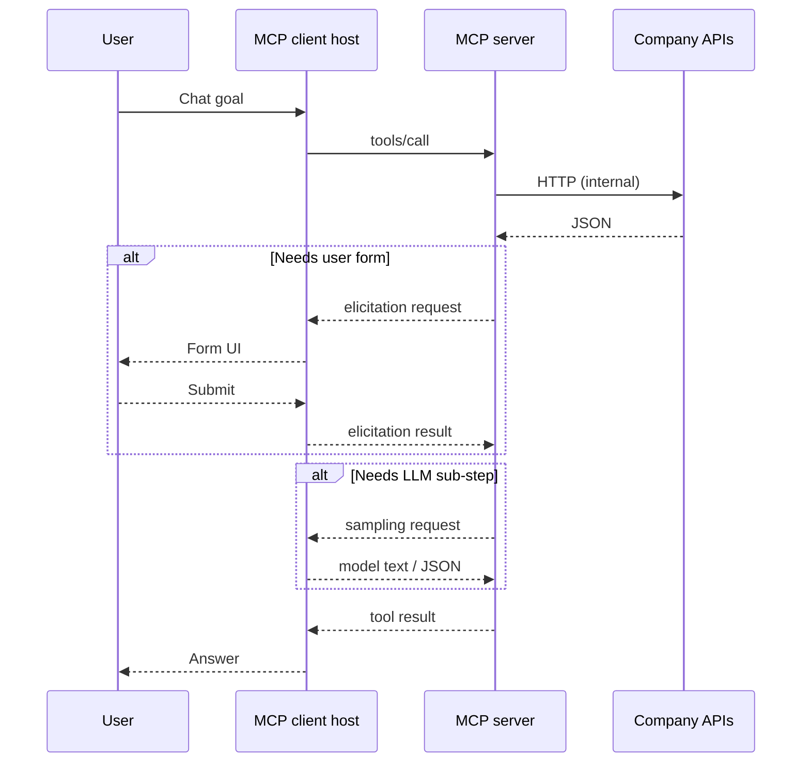

# MCP concepts — from junior to senior

This guide explains core **Model Context Protocol (MCP)** ideas in three layers: a **junior-friendly** mental model, a **mid-level** view tied to how hosts and servers behave, and a **senior** angle (protocol shape, capabilities, and system design). Examples refer to patterns used in **`AG.Mcp.Server`**.

---

## Concepts

**RPC (Remote Procedure Call)** — A style of communication where one program **calls a function or operation on another program** as if it were local, but the work runs elsewhere (another process, machine, or service). The caller sends a **request** with a method name and arguments; the callee returns a **result** or an **error**. MCP tools behave like RPC endpoints from the model’s perspective: *invoke named operation with JSON arguments, get a structured reply*.

**JSON-RPC** — A **lightweight RPC protocol** whose messages are encoded as **JSON objects** (typically over a byte stream or HTTP). Each request includes a method name and optional `params`; responses carry a `result` or an `error` object. MCP uses JSON-RPC so clients and servers stay **language-agnostic** and easy to debug; the same message shape can ride on **stdio** or **HTTP** transports.

---

## MCP server

**MCP (Model Context Protocol)**

**Junior:** A **standard way** for an AI assistant and your company’s data or actions to talk to each other safely. “Model” = the AI; “Context” = the facts, files, and tools it is allowed to use; “Protocol” = the shared rules so any editor or agent can plug in the same way.

**Mid:** An **open wire format** (JSON-RPC) plus a set of features—**tools**, **resources**, **prompts**, optional **UI**—so a **host** can give a model structured access to systems you control, without hard-wiring one vendor’s API inside the model.

**Senior:** A **vendor-neutral application-layer protocol** for agent↔tooling integration: session lifecycle, capability advertisement, namespaced primitives (tools/resources/prompts), and optional reverse RPC (sampling, elicitation). MCP separates **transport** (stdio, HTTP/SSE) from **message semantics**, so servers can be written in any stack and composed behind enterprise gateways.

**MCP server (the process you run)**

**Junior:** A small program (or service) that **answers questions from the AI’s app** on behalf of your systems. Instead of the chat app calling your database directly, it calls the MCP server, which you control.

**Mid:** An MCP server is a process that speaks **JSON-RPC** with a connected **MCP client**. It advertises what it can do (**tools**, **resources**, **prompts**, sometimes **apps**) and executes requests safely inside your boundary (call internal APIs, read files you allow, etc.).

**Senior:** The server implements the MCP **server** role: it handles lifecycle (initialize), capability negotiation, and request routing. In .NET (`ModelContextProtocol.AspNetCore`), the same host can expose **stdio** (subprocess, stdout is the wire) and **HTTP** (`MapMcp`). Transports differ; the **message schema** is shared. Design the server as a **policy and adapter layer**—authenticate outbound calls, enforce quotas, map stable tool contracts to unstable internal APIs.

---

## MCP client

**Junior:** The **IDE or app that hosts the AI** (for example Cursor) is the “client.” It connects to your MCP server and lets the model use what the server offers.

**Mid:** The MCP **client** is the component that maintains the session, sends tool calls, lists resources, and (if supported) handles **sampling** and **elicitation** requests **from** the server back to the user/model.

**Senior:** “Client” is a protocol role, not a product name. A single desktop app may embed an MCP client library that spawns your server as a child process (**stdio**) or opens an SSE/HTTP stream. Capability flags (`ClientCapabilities`) determine whether advanced flows (sampling, elicitation, UI) are legal; servers should **fail fast** with clear errors when a capability is missing—see `ClientSamplingTool` and `CreateClientElicitationTool` in this repo.

---

## MCP server tools

**Junior:** **Named actions** the AI can request: “list clients,” “create invoice,” “open a form.” You define names and parameters; the host shows them to the model and runs them when chosen.

**Mid:** Tools are **RPC-style** operations with JSON-serializable arguments and structured results. The model does not run code on your server; it **asks** the client to invoke a tool, and the client forwards the call to your server.

**Senior:** Tools are your **primary integration surface** for agents. Version them carefully; prefer **narrow, idempotent** tools where possible; validate inputs server-side; return **structured content** when hosts support it (`UseStructuredContent`). Treat tools as **API endpoints** with an AI-facing contract—document parameters with descriptions; they become part of the model’s context.

---

## MCP server prompts

**Junior:** **Reusable instruction templates** bundled with the server: “how we analyze a client,” “how we onboard.” They help the team standardize how the AI should think about a task.

**Mid:** Prompts are **parameterized templates** the client can discover and expand. They are not arbitrary hidden system prompts; they are **declared** capabilities the user or host can select, often with arguments (for example client id).

**Senior:** Prompts encode **organizational workflow** and guardrails without hard-coding them in every chat. They pair well with tools: prompt describes the procedure; tools perform side effects. Keep prompts **short, composable**, and safe—avoid leaking secrets; reference resources by URI instead of pasting large blobs.

---

## MCP server resources

**Junior:** **Read-only-ish pointers to data** the model can fetch when needed: policy text, calendar JSON, a link to “current client list snapshot.” Think “attachments the server knows how to resolve.”

**Mid:** Resources have **URIs** (including **URI templates** with variables). The client lists or reads them; content is typed (**MIME**). Large or sensitive data should stay **server-side**; expose slices or summaries via tools if listing everything is unsafe.

**Senior:** Resources model **context assembly**: what the model is allowed to see without executing arbitrary queries. Use **templates** for multi-tenant patterns (`…/{id}`). Consider caching, authz per URI, and size limits. In this solution, examples include **UI HTML**, **calendar JSON**, and **client-related** artifacts—see `[McpServerResource]` types under `AG.Mcp.Server`.

---

## MCP server apps (UI resources)

**Junior:** Some MCP servers ship a **tiny web UI** the chat can open inside the tool experience—forms, dashboards—instead of only text back-and-forth.

**Mid:** An **MCP App** is typically an **HTML resource** with a specific MIME profile (for example `text/html;profile=mcp-app`) and a stable **UI URI** (`ui://…`). The host renders it in a sandboxed surface; the page talks to your HTTP APIs as you design.

**Senior:** Apps bridge **human-in-the-loop** and **agent** flows: structured actions where visual confirmation matters. You must align **CSP**, asset URLs (**base href**, inlined bundles), and **cookie/auth** rules—embedded UIs often cannot rely on full-site SSO. This repo’s **`open_clients_ui`** tool and **`UiResources`** illustrate serving a built Angular app through the MCP resource pipeline.

---

## Sampling

**Junior:** Sometimes the **server** needs a quick **AI judgment** mid-task—for example “read this paragraph and extract fields as JSON”—without the user typing again. **Sampling** is the server asking the **client’s model** to do that sub-step.

**Mid:** The server sends a **`CreateMessageRequestParams`** (messages, token limits, etc.); the client runs its configured **sampling handler** and returns assistant content. If the client does not advertise sampling, the server should error clearly.

**Senior:** Sampling is **server-initiated LLM inference** over the same MCP session. It raises **policy** questions: which model, which tenant, cost attribution, and **data residency** (user text leaves your server boundary into the client’s model). Implement timeouts, token caps, and **output validation** (parse JSON, reject tool-like content). See **`ClientSamplingTool`** (`SampleAsync`) in this repo.

---

## Elicitation

**Junior:** When the AI does not have all **required fields**, **elicitation** lets the server **ask the UI** to show a small form; the user fills it; the server continues.

**Mid:** The server sends an **`ElicitRequestParams`** message (message + **schema** for fields). The host renders a form; the user accepts or cancels; the result returns to the server, which proceeds or aborts.

**Senior:** Elicitation is **structured HITL** without inventing ad-hoc chat parsing. It requires **client capability** (`Elicitation.Form`). Schema should mirror your API DTOs; validate again server-side after elicitation. Prefer elicitation over “please type your tax id in chat” for **PII** and **auditability**. See **`CreateClientElicitationTool`** (`ElicitAsync`) in this repo.

---

## How the pieces work together

---

## Quick glossary

| Term | One line |
|------|-----------|
| **MCP** | Model Context Protocol: open rules for model + context (tools/resources) over JSON-RPC. |
| **RPC** | Remote procedure call: invoke a named operation on another program, get a result or error. |
| **JSON-RPC** | RPC where requests and responses are JSON objects; MCP’s message layer. |
| **Transport** | How JSON-RPC moves: stdio pipe vs HTTP/SSE. |
| **Capability negotiation** | Client and server declare what optional features they support. |
| **Tool** | Callable action with arguments and a result. |
| **Resource** | Addressable content the model can read. |
| **Prompt** | Declared template for guided behavior. |
| **App / UI resource** | HTML UI surfaced through MCP for interactive tasks. |
| **Sampling** | Server asks the host’s model for a completion. |
| **Elicitation** | Server asks the host to collect structured user input. |

For how this repository wires these pieces, see **`README.md`** in the `AG.MCP` folder and **`Program.cs`** in **`AG.Mcp.Server`**.
