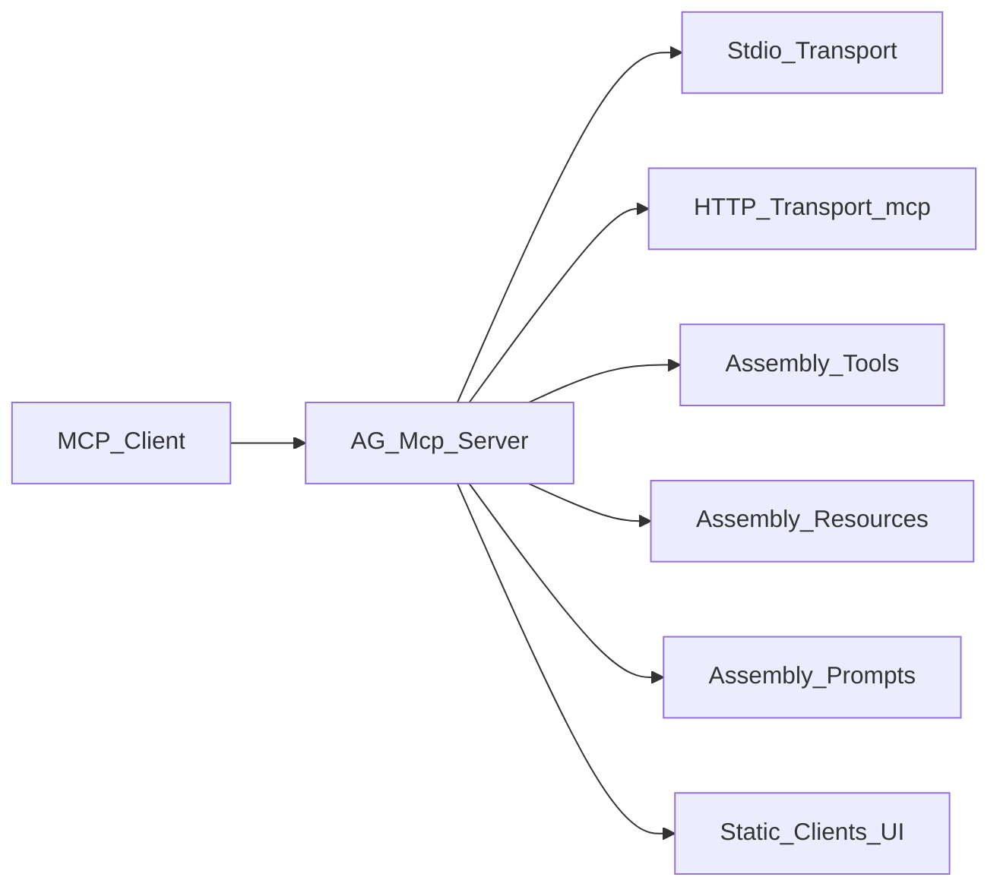
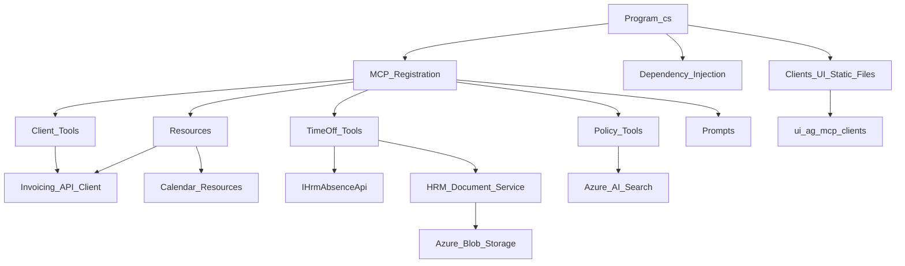

# AG.Mcp.Server Source Documentation

This document analyzes the files under `AG.MCP/AG.Mcp.Server`. Unlike `AG-mcp-server.md`, which documents only the running MCP server surface, this document is source-based and includes implementation structure, configuration, dependencies, and notable code paths from the server project.

## Project Purpose

`AG.Mcp.Server` is a .NET web executable that hosts a Model Context Protocol server. It exposes MCP tools, resources, and prompts for three main areas:

- L&L invoicing client operations.
- L&L  HR time-off planning, time-off submission, holiday calendars, and policy Q&A.
- An embedded clients UI served as an MCP App resource.

The active source areas are:

- `Program.cs`: application startup, dependency injection, MCP registration, and static asset hosting.
- `Clients/`: invoicing client tools, resources, sampling, elicitation, and prompts.
- `InvoicingApi/`: HTTP client wrapper for the invoicing backend.
- `Ui/`: MCP App resource and UI-opening tool.
- `TimeOff/`: time-off planning/submission tools, prompt, request models, and HR absence API contract.
- `Calendar/`: work and employee calendar resources.
- `Documents/`: benefits policy search tool and blob-backed PDF document service.

`Invoices/`, `Payments/`, and `Reports/` currently contain placeholder `.gitkeep` files only.

## Runtime Shape

The server is configured in `Program.cs` as an ASP.NET Core app with both stdio and HTTP MCP transports.

Key startup behavior:

- Redirects `Console.Out` to `Console.Error` so stdio MCP JSON-RPC messages are not corrupted by ordinary output.
- Registers MCP with `WithStdioServerTransport()` and `WithHttpTransport()`.
- Sets HTTP transport `Stateless = false`, which is required for server-to-client MCP features such as sampling and elicitation.
- Registers a manually created `open_clients_ui` tool, then discovers additional tools, prompts, and resources from the assembly.
- Maps the MCP endpoint at `/mcp`.
- Serves built clients UI files from `wwwroot/clients-ui` at request path `/clients-ui`.

## Project And Package Files

`AG.Mcp.Server.csproj`

- Uses `Microsoft.NET.Sdk.Web`.
- Targets `net10.0`.
- Enables nullable reference types and implicit usings.
- References MCP SDK packages: `ModelContextProtocol` and `ModelContextProtocol.AspNetCore`.
- References Azure packages for identity, search, and blob storage.
- References `RestEase` for typed REST API clients.
- References `PdfPig` for extracting text from PDF documents.
- Embeds `Clients/Prompts/*.md` as resources.
- Copies `appsettings.json` to output.

`package.json`

- Provides convenience scripts around the .NET server.
- `npm start` runs `dotnet run --urls http://localhost:7070`.
- `npm run dev` launches the MCP inspector against the server command.
- Adds `@modelcontextprotocol/inspector` as a dev dependency.

`Properties/launchSettings.json`

- Defines a development launch profile for the project.
- Sets `ASPNETCORE_ENVIRONMENT` to `Development`.
- Uses local HTTP and HTTPS application URLs.

## Configuration

`appsettings.json` contains the main local configuration sections:

- `Logging`: standard ASP.NET Core log level settings.
- `AllowedHosts`: host filtering setting.
- `AbceggApi`: invoicing API base URL and timeout. This binds to `InvoicingApiOptions.SectionName`.
- `AzureSearch`: endpoint and index name used by policy search.
- `Azure`: optional `ClientId` for managed identity in production or staging.
- `AngularUi`: configured Angular UI base URL.
- `McpServer`: public base URL used when building UI resource asset URLs.
- `HRM_BLOB_SERVICE_URI`: blob service URI used for HR benefit plan documents.

`Program.cs` also supports:

- `appsettings.{Environment}.json`.
- User secrets.
- Environment variables.
- `HRM_BLOB_SERVICE_CONNECTIONSTRING`, which takes precedence over the blob service URI when present.

The code chooses credentials by environment:

- Production and staging use `ManagedIdentityCredential` when `Azure:ClientId` is configured, otherwise `DefaultAzureCredential`.
- Other environments use `DefaultAzureCredential`.

## Dependency Injection And External Services

Registered services in `Program.cs`:

- `SearchClient`: singleton Azure AI Search client for benefits policy retrieval.
- `BlobServiceClient`: singleton Azure Blob Storage client, using either a connection string or URI plus Azure credential.
- `IHrmDocumentService` / `HrmDocumentService`: singleton service for listing and reading HR policy PDFs.
- `IInvoicingApiClient` / `InvoicingApiClient`: HTTP client for invoicing API operations.

Important implementation note:

- `IHrmAbsenceApi` is consumed by `PlanTimeOffTool`, `RequestTimeOffTool`, and `CalendarResources.EmployeeCalendarResource`.
- No registration for `IHrmAbsenceApi` appears in the `AG.Mcp.Server` source files inspected. Unless it is registered externally at runtime, those components will fail dependency resolution when invoked.

## MCP Tools

### General Tool

`EchoTool.cs`

- Defines `EchoMessage`.
- Echoes a supplied message.
- Supports an optional repeat count.
- Primarily appears to be a simple sample or diagnostic tool.

### Client Tools

`Clients/Tools/ClientsTool.cs`

Defines client CRUD and summary tools backed by `IInvoicingApiClient`:

- `GetClients`: paginated client listing with optional search, sort field, and descending sort flag.
- `GetClientById`: retrieves one client by GUID.
- `CreateClient`: programmatic client creation. The description explicitly says conversational creation should use `create_client_elicit`.
- `UpdateClient`: updates an existing client by GUID.
- `GetClientSummary`: retrieves client financial summary data.

`Clients/Tools/CreateClientElicitationTool.cs`

- Defines the explicitly named MCP tool `create_client_elicit`.
- Accepts nullable `name`, `taxId`, `email`, `phone`, and `address`.
- Creates immediately when `name` and `taxId` are present.
- If required fields are missing, checks whether the MCP client supports form elicitation.
- Calls `server.ElicitAsync` to collect missing form fields.
- Throws a clear MCP exception when elicitation is unavailable or declined.

`Clients/Tools/ClientSamplingTool.cs`

- Defines the explicitly named MCP tool `sample_create_client_action`.
- Requires MCP sampling support from the client.
- Sends a sampling request that asks the client LLM to convert natural language into a structured create-client action.
- Extracts JSON from the sampling response.
- Normalizes valid actions to target `create_client_elicit`.

### UI Tool

`Ui/UiTools.cs` and `Program.cs`

- `UiTools.OpenClientsUi` returns a short instruction string.
- `Program.cs` wraps it as an MCP tool named `open_clients_ui`.
- Tool metadata includes the UI resource URI `ui://ag.mcp/clients` under both `ui.resourceUri` and legacy `ui/resourceUri`.

### HR And Policy Tools

`TimeOff/PlanTimeOffTool.cs`

- Defines `PlanTimeOff`.
- Requires `IHrmAbsenceApi` and `IHrmDocumentService`.
- Retrieves employee calendar, employee details, eligible absence types, work calendars, and vacation/time-off policy document text.
- Returns multiple MCP content blocks, including embedded JSON resources and policy text.

`TimeOff/RequestTimeOffTool.cs`

- Defines `RequestTimeOff` with `UseStructuredContent = true`.
- Accepts employee ID and a simplified request model.
- Looks up eligible absence types, maps the simplified request to the HR absence request shape, and submits it through `IHrmAbsenceApi`.
- Maps `TimeOffDayType` values to start/end times and daily quantity.
- Wraps HR API failures in `McpException`.

`Documents/AskAboutPolicyTool.cs`

- Defines `AskAboutPolicy`.
- Uses Azure AI Search vector search against `text_vector`.
- Maps `PolicyQuestionType` enum values to query text.
- Returns relevant benefit policy document excerpts as text content blocks.

## MCP Resources

`Clients/Resources/ClientResources.cs`

Exposes three JSON resources:

- `l&linvoicing://clients`: gets page 1 with page size 50 from the invoicing API.
- `l&linvoicing://clients/{clientId}`: parses the client ID as a GUID and returns one client.
- `l&linvoicing://clients/{clientId}/summary`: parses the client ID as a GUID and returns financial summary data.

Invalid GUIDs and missing clients are reported with MCP protocol exceptions.

`Calendar/CalendarResources.cs`

Exposes calendar resources:

- `L&L ://hrm/calendars/work`: returns annual US and India holiday calendars for the current year.
- `L&L ://hrm/calendars/employee/{employeeId}`: returns an employee's planned time off through `IHrmAbsenceApi`.
- `L&L ://hrm/calendars/work/{year}/{location}`: returns a work calendar for a specific year and `WorkLocation`.

The `WorkLocation` enum supports `UnitedStates` and `India`.

`Ui/UiResources.cs`

Exposes the MCP App resource:

- `ui://ag.mcp/clients`
- Name: `clients-ui`
- MIME type: `text/html;profile=mcp-app`

The resource implementation:

- Reads `wwwroot/clients-ui/browser/index.html`.
- Falls back to a small HTML message when the built UI is missing.
- Inlines CSS files referenced from `/clients-ui/browser/`.
- Removes module preload links.
- Inlines the bundled `mcp-bundle.js` script.
- Rewrites base, href, and src paths for MCP App hosting.
- Adds a script that defaults the hash route to `#/clients/agent-create`.
- Adds MCP UI CSP metadata for connect and resource domains.

Notable source concern:

- `UiResources.DebugLog` writes diagnostic entries to an absolute local path under `c:\AndresG\AICourses\RAGAzure\debug-a2af49.log`. This is useful during debugging but is environment-specific and should be reviewed before sharing or deploying broadly.

`Documents/DocumentResources.cs`

- Contains commented-out resource code for HR document listing and PDF retrieval.
- Because the file content is commented, these document resources are not active MCP resources as written.

## MCP Prompts

`Clients/Prompts/ClientsPrompts.cs`

Registers prompt methods and loads most prompt text from embedded Markdown files.

Registered client prompts:

- `Client Financial Analysis Guide`
- `Client Lookup Guide`
- `Client Onboarding Guide`
- `Client List Management Guide`
- `Client Update Guide`
- `Client Validation Guide`
- `Client Search Guide`
- `Client Exact Name Search`
- `Bulk Client Operations Guide`

`Client Exact Name Search` is generated directly in code and accepts a required `name` argument. It instructs the client to use `GetClients` with search and then filter results to exact `Name` matches because the search endpoint can return contains matches across multiple fields.

Embedded Markdown files present in `Clients/Prompts/` include additional prompt drafts such as `client-activity-report.md`, `client-health-check.md`, `client-support.md`, `client-verification.md`, and `high-value-clients.md`. These files are embedded by the project file, but no registered prompt methods were found for them in `ClientsPrompts.cs`.

`TimeOff/TimeOffPrompts.cs`

Registers:

- `Suggest Time Off Work`

The prompt accepts an `employeeId` integer and asks the assistant to use the time-off planning tool to suggest good vacation dates such as long weekends.

## Invoicing API Layer

`InvoicingApi/IInvoicingApiClient.cs`

Defines the server's abstraction for client operations:

- List clients.
- Get client by ID.
- Create client.
- Update client.
- Get client summary.

`InvoicingApi/InvoicingApiClient.cs`

Implements the abstraction using `HttpClient` and RestEase.

Implementation details:

- Binds base URL and timeout from `InvoicingApiOptions`.
- Creates a RestEase client for an internal `IInvoicingApiRestClient`.
- Uses base path `api/clients`.
- Maps operations to REST endpoints:
  - `GET api/clients`
  - `GET api/clients/{id}`
  - `POST api/clients`
  - `PUT api/clients/{id}`
  - `GET api/clients/{id}/summary`

`InvoicingApi/Models/`

Contains DTOs and paged result types used by the client tools and resources.

## HR Document And Policy Layer

`Documents/HrmDocumentService.cs`

Implements `IHrmDocumentService` over Azure Blob Storage.

Capabilities:

- Lists policy documents from the `L&L hrm` container.
- Reads blob metadata into `DocumentInfo`.
- Downloads document content as base64.
- Downloads PDF content and extracts plain text with PdfPig.

The plain-text extraction method opens the PDF and iterates pages and words, appending extracted word text to build a searchable policy text payload for MCP responses.

`Documents/AskAboutPolicyTool.cs`

Uses `SearchClient` directly instead of `IHrmDocumentService`. It performs vector search and returns selected fields: `title`, `chunk_id`, and `chunk`.

## Time-Off Layer

`TimeOff/HrmAbsenceApi.cs`

Defines a RestEase interface for HR absence endpoints:

- Authenticated employee ID.
- Eligible absence types.
- Worker details.
- Request time off.
- Worker benefit plans.
- Worker planned time off.

`TimeOff/TimeOffRequestType.cs`

Maps user-friendly request types to HR absence type codes:

- `Vacation` to `VACATION`.
- `PersonalHoliday` to `FLEX_DAY`.
- `SickDay` to `SICK_LEAVE`.
- `MedicalOrFMLALeave` to `MEDICAL_LEAVE`.
- `PersonalLeaveOfAbsence` to `LEAVE_OF_ABSENCE`.
- `Sabbatical` to `X_00SABBATICAL`.

`Models.cs`

Contains shared records for worker details, absence types, benefit plans, time-off requests, planned time off, and time-off responses.

## UI Asset Handling

The source expects the clients UI build under:

- `wwwroot/clients-ui/browser/index.html`
- `wwwroot/clients-ui/browser/mcp-bundle.js`
- related stylesheet and static assets

`Program.cs` creates `wwwroot/clients-ui` if it does not exist and serves it with permissive CORS headers for `GET` and `OPTIONS`.

`UiResources.ClientsUiResource` is designed for MCP App embedding rather than ordinary static hosting. It rewrites and inlines assets so the UI can run inside the MCP App iframe constraints.

## Notable Risks And Gaps

- `IHrmAbsenceApi` is declared and consumed but not registered in `Program.cs`, which can break `PlanTimeOff`, `RequestTimeOff`, and employee calendar resources at runtime.
- `DocumentResources.cs` is fully commented out, so HR document list/PDF resources are not active despite the service existing.
- Several Markdown prompt files are embedded but not exposed by registered prompt methods.
- `UiResources.DebugLog` writes to an absolute developer-machine path.
- `AskAboutPolicyTool` depends on Azure AI Search configuration and index shape, including a `text_vector` field plus `title`, `chunk_id`, and `chunk` fields.
- `HrmDocumentService.GetBenefitPlanDocumentContentAsync` catches all exceptions and returns the exception message as content, which can blur the line between document content and error reporting.

## Source-Based Architecture Summary

